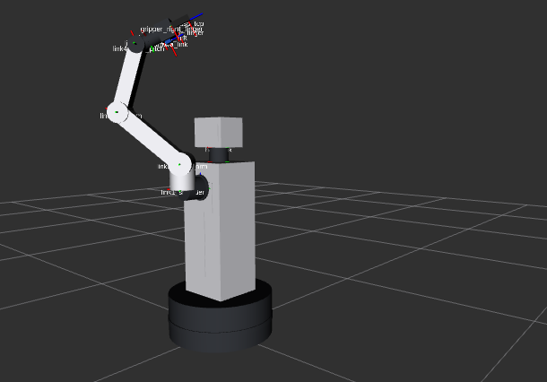
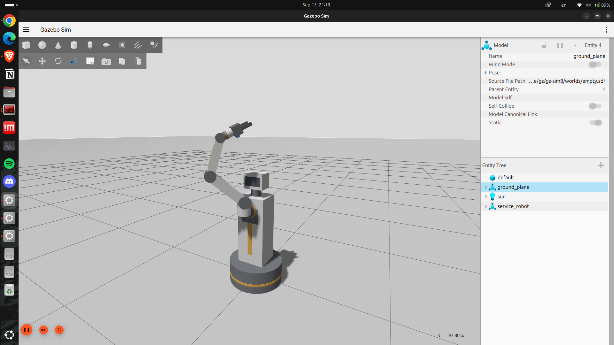

# arm_description — Simulasi Service Robot Manipulator 6-DOF

Proyek ini menyediakan model URDF/Xacro, konfigurasi simulasi fisika **Gazebo Sim (Harmonic)**, dan visualisasi **RViz2** untuk robot manipulator layanan domestik 6-DOF, dikembangkan pada lingkungan **ROS 2 Jazzy**.

---

| Tampilan Rviz2 | Tampilan Gazebo Sim |
| :--: | :--: |
|  |  |

## Fitur Utama

1. **Body Statis Realistis:**
   - **Base Chassis:** Silinder statis berdiameter 44 cm dan tinggi 18 cm tepat di atas permukaan lantai ($Z = 0$).
   - **Torso & Head:** Kolom badan vertikal (tinggi 55 cm) membawa pangkal sendi bahu ke ketinggian **$\approx 0.72\text{ m}$ dari lantai** (sesuai ketinggian meja dapur dan rak domestik).
2. **Lengan Manipulator 6-DOF:**
   - Sambungan pergelangan tangan (Joint 4 & Joint 5) terhubung rapi dengan *neck bracket* dan cincin flange bantalan.
   - Dilengkapi *gripper* 2 jari paralel (*parallel jaw*) dengan bantalan silikon (*stroke* total 80 mm) dan frame `camera_link` (*eye-in-hand perception*).
3. **Dinamika & Hukum Fisika Nyata:**
   - Dilengkapi properti massa, inersia, dan geometri benturan (`<collision>`) padat.
   - Terintegrasi dengan **`ros2_control`** via plugin `gz_ros2_control/GazeboSimSystem`.
   - Batasan mekanik sendi (*joint collision limits*) mencegah lengan menekuk menembus badan robot sendiri.
4. **Kontrol GUI Sinkron (RViz $\leftrightarrow$ Gazebo):**
   - Node penerjemah (`gui_to_controller.py`) menghubungkan slider GUI ke `joint_trajectory_controller` Gazebo sehingga pergerakan slider langsung menggerakkan motor fisik Gazebo dan divisualisasikan secara *real-time* di RViz.

---

## Struktur Direktori

```text
arm_sim_ws/
├── README.md
└── src/
    └── arm_description/
        ├── CMakeLists.txt              # Konfigurasi instalasi paket ament_cmake
        ├── package.xml                 # Dependensi paket ROS 2
        ├── config/
        │   └── arm_controllers.yaml   # Konfigurasi ros2_control (broadcaster & trajectory)
        ├── launch/
        │   ├── display.launch.py       # Visualisasi cepat di RViz dengan slider GUI
        │   ├── gazebo.launch.py        # Simulasi fisika penuh di Gazebo Sim (Harmonic)
        │   └── sim_control.launch.py   # Launch terintegrasi (Gazebo + RViz + Slider GUI)
        ├── rviz/
        │   └── arm.rviz                # Konfigurasi tampilan RViz2 (Fixed Frame: base_link)
        ├── scripts/
        │   └── gui_to_controller.py    # Node bridge: /gui_joint_states -> controllers
        └── urdf/
            └── arm.urdf.xacro          # Model robot Xacro lengkap
```

---

## Prasyarat Sistem

- **OS:** Ubuntu 24.04 LTS
- **ROS Version:** ROS 2 Jazzy Jalisco
- **Simulator:** Gazebo Sim Harmonic (`ros_gz_sim`)

Instal dependensi jika belum tersedia di sistem, jika sudah di install tidak usah lagi dijalankan:
```bash
sudo apt update
sudo apt install -y \
  ros-jazzy-xacro \
  ros-jazzy-robot-state-publisher \
  ros-jazzy-joint-state-publisher-gui \
  ros-jazzy-rviz2 \
  ros-jazzy-ros-gz-sim \
  ros-jazzy-ros-gz-bridge \
  ros-jazzy-gz-ros2-control \
  ros-jazzy-controller-manager \
  ros-jazzy-joint-state-broadcaster \
  ros-jazzy-joint-trajectory-controller \
  ros-jazzy-position-controllers
```

---

## Cara Build & Setup Workspace

Pastikan Anda berada di direktori root workspace:

```bash
cd ~/arm_sim_ws
colcon build --symlink-install
source install/setup.bash
```

---

## Panduan Menjalankan Simulasi

Tersedia 3 mode peluncuran sesuai kebutuhan:

### 1. Visualisasi Kinematika Cepat (RViz Saja)
Gunakan mode ini untuk menguji jangkauan (*reach envelope*) tanpa membebani CPU/GPU dengan simulasi fisika Gazebo:
```bash
ros2 launch arm_description display.launch.py
```

### 2. Simulasi Fisika Nyata (Gazebo Sim)
Gunakan mode ini untuk menjalankan simulasi rigid-body penuh (gravitasi, massa, dan kontak fisik):
```bash
ros2 launch arm_description gazebo.launch.py
```

### 3. Simulasi Terintegrasi + Kontrol Slider GUI (Disarankan)
Menjalankan Gazebo Sim, RViz2, dan slider GUI secara bersamaan. Menggerakkan slider akan otomatis menggerakkan robot di Gazebo dan RViz secara tersinkronisasi:
```bash
ros2 launch arm_description sim_control.launch.py
```

---

## Daftar Sendi (*Joints*) & Batasan Gerak

| Nama Sendi | Tipe | Sumbu | Batas Gerak | Keterangan |
| :--- | :---: | :---: | :---: | :--- |
| `joint1_shoulder_yaw` | Revolute | Z | $-2.1$ s/d $+2.1$ rad | Rotasi bahu (dibatasi agar tidak menembus torso belakang) |
| `joint2_shoulder_pitch`| Revolute | Y | $-0.5$ s/d $+1.8$ rad | Angkat bahu (dibatasi agar tidak menabrak kepala/dada) |
| `joint3_elbow_pitch` | Revolute | Y | $-2.2$ s/d $+1.5$ rad | Tekukan siku |
| `joint4_wrist_pitch` | Revolute | Y | $-1.8$ s/d $+1.8$ rad | Pitch pergelangan tangan |
| `joint5_wrist_yaw` | Revolute | Z | $-3.14$ s/d $+3.14$ rad | Yaw pergelangan tangan |
| `joint6_wrist_roll` | Revolute | Z | $-3.14$ s/d $+3.14$ rad | Roll gripper |
| `gripper_left_finger_joint` | Prismatic | Y | $0.0$ s/d $0.04$ m | Capit kiri |
| `gripper_right_finger_joint`| Prismatic | -Y| $0.0$ s/d $0.04$ m | Capit kanan |

---
